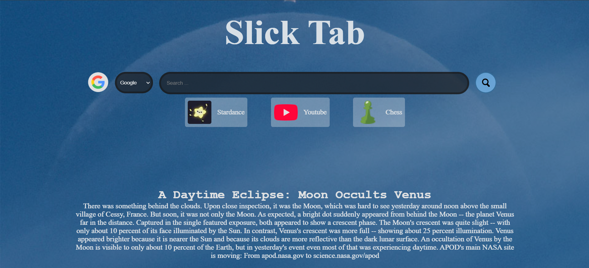

# Slick Tab

**Slick Tab features ->**
 - APOD! - It uses NASA API to fetch the APOD image and its details.
 - Multisearch Bar - The searchbar lets you seamlessly switch between different search engines and AI tools.
 - Shortcuts tab - It lets you navigate to sites like - Stardance, Youtube and Chess

  

